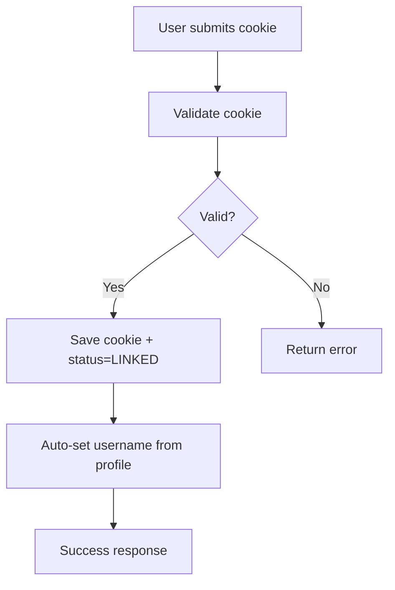
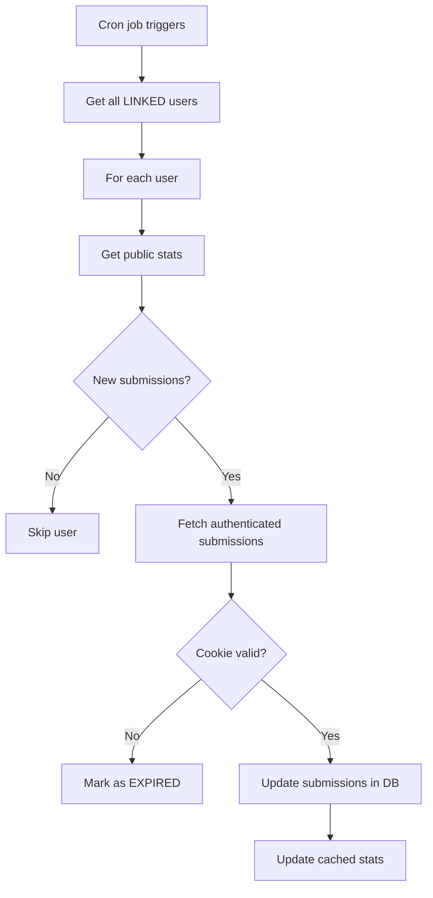

# 🚀 Enhanced LeetCode Integration

This document describes the enhanced LeetCode submission tracking system that replaces the previous GraphQL-based approach with authenticated API calls using the `leetcode-query` package.

## 📋 Overview

The enhanced system provides:
- **Authenticated submission tracking** using LeetCode session cookies
- **Comprehensive statistics** including difficulty breakdowns
- **Real-time sync capabilities** with automated background updates
- **Improved accuracy** by accessing all user submissions (not just recent 20)
- **Cookie session management** with expiration detection
- **Manual sync triggers** for teachers

## 🔧 Technical Architecture

### Database Schema Updates

New fields added to the `User` model:
```prisma
model User {
  // ... existing fields ...
  leetcodeCookie     String?          // Encrypted session cookie
  leetcodeCookieStatus String        @default("NOT_LINKED") // LINKED, EXPIRED, NOT_LINKED
  leetcodeTotalSolved  Int?           // Cached total problems solved
  leetcodeEasySolved   Int?           // Cached easy problems solved
  leetcodeMediumSolved Int?           // Cached medium problems solved
  leetcodeHardSolved   Int?           // Cached hard problems solved
}
```

### New API Endpoints

#### POST `/api/v1/auth/leetcode-credentials`
Links a user's LeetCode account using their session cookie.

**Request:**
```json
{
  "leetcodeCookie": "session_cookie_value"
}
```

**Response:**
```json
{
  "message": "LeetCode account linked successfully",
  "user": { /* updated user object */ }
}
```

#### POST `/api/v1/assignments/:assignmentId/sync-leetcode`
Manually triggers LeetCode sync for all students (teacher only).

**Response:**
```json
{
  "message": "LeetCode submission sync completed",
  "assignmentTitle": "Assignment Name"
}
```

### Enhanced Services

#### `enhanced-leetcode.service.ts`
Core service handling LeetCode integration:

- `fetchPublicLeetCodeStats()` - Gets public profile statistics
- `fetchAuthenticatedSubmissions()` - Fetches submissions using session cookie
- `fetchAuthenticatedStats()` - Gets comprehensive stats via authenticated API
- `fetchLeetCodeStatsAndSubmissions()` - Main sync function for individual users
- `syncAllLinkedLeetCodeUsers()` - Syncs all users with linked accounts

### Automated Scheduling

New cron job runs every 4 hours:
```typescript
cron.schedule('0 */4 * * *', () => {
  syncAllLinkedLeetCodeUsers();
});
```

## 🎨 Frontend Enhancements

### Enhanced Profile Page

New LeetCode Integration section includes:
- **Connection status** indicator (Linked/Expired/Not Linked)
- **Statistics display** showing solved problems by difficulty
- **Cookie submission form** with detailed instructions
- **Real-time feedback** on linking success/failure

### How Users Link Their Account

1. **Navigate to Profile Page** (`/profile`)
2. **Find LeetCode Integration section**
3. **Follow cookie extraction instructions:**
   - Login to LeetCode
   - Open Developer Tools (F12)
   - Go to Application/Storage tab
   - Find Cookies → https://leetcode.com
   - Copy LEETCODE_SESSION cookie value
4. **Paste cookie in form and submit**
5. **System validates** cookie by making test API call
6. **Account gets linked** and submissions are tracked automatically

## 🔄 Sync Process Flow

### Initial Linking


### Regular Sync Process


## 📊 Data Flow

### Statistics Caching
- **Public API calls** get basic stats (rate limited, but always available)
- **Authenticated calls** get comprehensive submission data
- **Cached statistics** reduce API calls and improve performance
- **Smart updates** only sync when new submissions detected

### Submission Matching
- **URL parsing** extracts problem slugs from assignment URLs
- **Slug matching** compares fetched submissions against assigned problems
- **Timestamp tracking** records when submissions were completed
- **Bulk updates** minimize database operations

## 🛡️ Security & Privacy

### Cookie Storage
- Session cookies stored securely in database
- Cookies encrypted at rest (depending on DB configuration)
- No plain-text storage of sensitive authentication data

### Session Management
- **Automatic expiration detection** when API calls fail
- **Status tracking** (LINKED/EXPIRED/NOT_LINKED)
- **User notification** when re-authentication needed

### Rate Limiting
- **1-second delays** between user syncs
- **4-hour sync intervals** to respect LeetCode's API limits
- **Intelligent caching** to minimize unnecessary API calls

## 🧪 Testing

### Test Script
Run the enhanced integration test:
```bash
cd server
npx ts-node -r tsconfig-paths/register ./scripts/test-enhanced-leetcode.ts
```

### Manual Testing Steps
1. **Link Account**: Test cookie validation and linking
2. **Check Stats**: Verify statistics display in profile
3. **Sync Trigger**: Test manual sync via assignment page
4. **Expiration**: Test behavior with invalid/expired cookies

## 🚀 Deployment Considerations

### Environment Variables
```bash
# Optional: For testing scripts
LEETCODE_SESSION_COOKIE="test_cookie_value"
```

### Database Migration
Run after schema updates:
```bash
cd server
npx prisma db push          # Development
npx prisma migrate deploy   # Production
```

### Monitoring
- **Cron job logs** for sync success/failure rates
- **API error tracking** for LeetCode service issues
- **User linking statistics** to monitor adoption

## 🔮 Future Enhancements

### Planned Features
- **Difficulty-aware statistics** with proper categorization
- **Submission timeline** showing progress over time
- **Competitive programming contests** integration
- **Multi-platform unified tracking** (LeetCode + HackerRank + GFG)

### Performance Optimizations
- **Incremental sync** fetching only new submissions
- **Background processing** for large user bases
- **Caching layers** for frequently accessed data
- **Database optimization** for submission queries

## 🆘 Troubleshooting

### Common Issues

**Cookie Expired**
- Symptom: Status shows "EXPIRED"
- Solution: Re-extract and submit new cookie

**No Submissions Detected**
- Check: Username matches LeetCode profile
- Check: Problems assigned are from LeetCode platform
- Check: URL format matches expected pattern

**Sync Not Working**
- Check: Cron jobs are running
- Check: Database connections stable
- Check: LeetCode API accessibility

### Debug Commands
```bash
# Check user statistics
cd server
npx prisma studio

# Test API connectivity
npx ts-node -r tsconfig-paths/register ./scripts/test-enhanced-leetcode.ts

# Manual sync trigger
curl -X POST "/api/v1/assignments/{id}/sync-leetcode" -H "Authorization: Bearer {token}"
```

## 📈 Benefits Over Previous System

### Accuracy Improvements
- ✅ **All submissions** accessible (vs previous ~20 limit)
- ✅ **Real-time statistics** with difficulty breakdown
- ✅ **Session-based authentication** for complete data access

### User Experience
- ✅ **One-time setup** vs manual username updates
- ✅ **Automatic tracking** with background sync
- ✅ **Visual feedback** with status indicators

### Teacher Benefits
- ✅ **Manual sync triggers** for immediate updates
- ✅ **Enhanced statistics** for better insights
- ✅ **Reliable tracking** with session management

---

This enhanced system provides a robust, scalable, and user-friendly approach to LeetCode submission tracking that significantly improves upon the previous GraphQL-based implementation. 